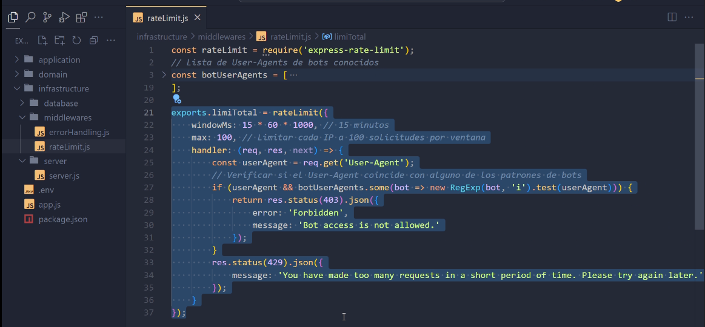
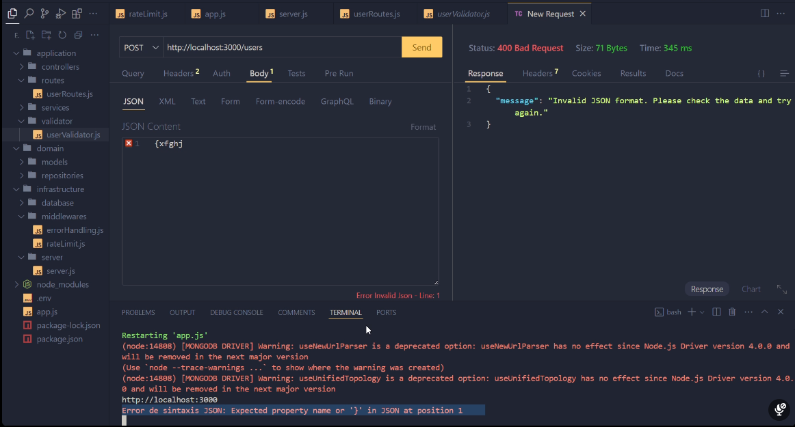

# Notas de Clase

---

### Control de Errores en el Servidor
- **Objetivo:** Evitar que el servidor se caiga debido a errores inesperados.
- **Estrategia:** Implementar un manejo de errores adecuado para capturar y controlar los mensajes de error, lo que ayuda a mantener la estabilidad del servidor.

### Ratelimit
- **Descripción:** Limita la cantidad de veces que se puede consumir una API.
- **Propósito:** Controlar la cantidad de peticiones al servidor para protegerlo de abusos.
- **Métodos de Limitación:**
  - Por cantidad de ventanas abiertas.
  - Por cantidad de peticiones.

- **Gestión de Cookies:** El ratelimit puede ayudar a gestionar las cookies en relación con las peticiones.

### Configuración de Infraestructura
- **Autenticación:** Configuración relacionada con la autenticación de dos factores.

### Manejo de Peticiones Incorrectas
- **Ejemplo:** El servidor maneja adecuadamente los pedidos incorrectos sin caer.
  

### Estructura del Código
- **Repositories:**
  - Implementación de todas las clases abstractas.
  - Declaración de todos los métodos que una clase debe tener.

- **Repository:**
  - Clases que se heredan de `Service`.

- **DTO vs. Try-Catch:**
  - **DTO (Data Transfer Object):** Preferido sobre `try-catch` en la carpeta de repositories para evitar que el servidor se caiga.

### Flujo de Datos
- **Secuencia:**
  1. `app` → `controlador` → `servicio` → `repositorio` → `model`
  2. `model` → `controlador` → `router`

---
